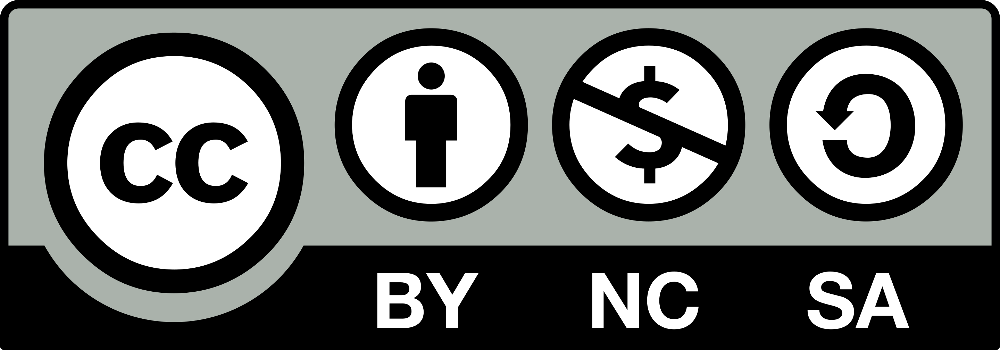

# Novel

## 仓库简介

本仓库收录了Zn创作的以跨性别、性别认同等为主题的原创小说，旨在记录成长、探索与治愈的故事。

## 阅读须知

> ⚠️<u>**部分内容涉及性别认同、心理成长等敏感话题，请理性阅读。如有不适，请及时退出。**</u>

> ‼️<u>**本仓库内的一切内容均不构成医疗建议，如有不适，请线下就医。**</u>

> 🈲<u>**请勿模仿文中的任何行为。小说内容仅为虚构创作，现实生活中请遵守法律法规及社会规范。因模仿或参考文中行为而造成的任何后果，作者概不负责。**</u> 

> 🔞<u>**本仓库内容建议18岁及以上读者阅读。**</u>

> 💬<u>**作品内容仅代表作者个人观点，与任何组织、机构或团体无关。**</u>

> 🔒<u>**请尊重作者及相关人物隐私，勿对文中角色或事件进行现实追查。**</u>

## 作品共同标签

- 跨性别
- 双女主
- 服药
- 宗教
- 药娘
- 性别认同
- LGBTQ+
- 自我探索
- 亲密关系描写
- 青春成长
- 情感描写
- 精神健康
- 家庭关系
- 校园
- 亲密关系
- 生命
- 医学

## 作品目录

### （已完结）[散文《困》](./散文%20《困》.pdf)

> 这是一篇创作于作者高中时期的作品，全文以独特的形式文学手法展开，通过结构、语言和意象的巧妙安排，展现了对“困”这一主题的深刻思考。文章借助形式上的创新与讽刺，探讨了个体在现实与自我之间的挣扎与困顿，通过反复、跳跃的句式和意象，营造出一种压抑、迷茫的氛围，巧妙地讽刺了社会与个人之间的隔阂与无力感。整篇散文以文学形式为载体，表达了对困境的感受与反思，体现了作者在高中时期对文学表现力的探索与尝试。

### （已完结）[消失的姐姐](./消失的姐姐.md)

> ❗️请注意：本小说涉及**精神健康**、**家庭冲突**与**转生**等敏感话题，内容较为沉重。阅读时请根据自身心理状态酌情选择。如有相关困扰，请及时寻求专业帮助与支持。

> 这是一篇以真实经历为底色的成长小说，讲述了主人公与“姐姐”在网络相识、相知、相伴的温暖与苦难。两人在彼此的陪伴中获得了珍贵的情感支持和安全感。故事细腻描绘了她们共同面对家庭压力、社会偏见、疾病困扰的过程。小说以真挚的笔触展现了跨性别、心理健康与亲情的复杂交织，温柔而深刻，令人动容。

### （已完结）[关于控制高校跨性别毒素外扩的研究报告（修订版）](./关于控制高校跨性别毒素外扩的研究报告（修订版）.pdf)

> 本篇报告以冷峻而锋利的笔触，剖析了高校环境中跨性别群体所遭遇的复杂困境。作者以极为理性、客观的报告体裁，摒弃冗余修饰，直面现实，将一个极为特殊的视角呈现于读者面前。通过对校园生活细致入微的观察与分析，报告揭示了跨性别者在制度、文化与人际交往层面所遭遇的种种障碍与挑战。全篇以冷静、克制的语调，力图让读者在理性审视的同时，感受到困境背后的深层张力与现实冲突。

### （未完结）[戊酸雌二醇致这具身体的一封信](./戊酸雌二醇致这具身体的一封信.md)

> 这是一封来自戊酸雌二醇的“信”，以药物的视角，细腻描绘了一位跨性别者在自我认同、家庭冲突、成长蜕变中的真实经历。故事融合了温柔的陪伴、痛苦的挣扎与勇敢的追寻，展现了在孤独与希望交织下，主人公如何一步步走向自我和新生。

### （未完结）[在什么时候人才不会对自己说谎](./在什么时候人才不会对自己说谎.md)

> 本篇以细腻的笔触，描绘了跨性别者在真实生活中的相遇与陪伴。故事通过亲密互动与心理碰撞，展现了主人公在性与自我认同之间的探索与成长。它不仅关注身体的变化，更深入刻画了跨性别者在情感、身份和自我接纳上的挣扎与蜕变，温柔而真诚地呈现了“成为自己”的旅程。

## 目录结构

- README.md：仓库说明
- 作品名.md：各篇小说正文
- 作品名.pdf：已排版后的小说正文
- Source/：图片、tex源文件及其他素材

## 许可协议与著作权

在无额外说明的情况下，本仓库内所有由wujx3433创作的作品，在转载时均需要遵循[CC BY-NC-SA 4.0](https://creativecommons.org/licenses/by-nc-sa/4.0/)（即署名-非商业性使用-相同方式共享）协议。

> Copyright © 2025 wujx3433 aka Zn.

## 反馈与交流

欢迎通过 Issues 或邮箱联系作者，提出建议或交流感受。

📬 **作者的电子邮箱**：[wujx3433@gmail.com](mailto:wujx3433@gmail.com)

📢 **作者的 Telegram 频道**：[点击加入](https://t.me/ZnP_mansion)

## FAQ

  
作品会持续更新吗？

  <ul>目前标记为<b>（未完结）</b>的作品仍在连载中，作者会不定期更新内容，可以<a href=https://t.me/ZnP_mansion>加入作者的Telegram频道</a>来获取最新通知，也可以通过频道的群组来向作者催更或贡献好点子。</ul>

  
可以投稿或合作吗？

  <ul>目前作者并不接受使用 Pull Requests 功能直接接受投稿，但作者依旧欢迎各位有好点子的朋友与我共同探讨关于成长的话题，说不定你的创意就会被我写进正文中。 
  如果您提供的创意足够丰富，您或许可以成为某篇文章的共同创作者。</ul>

  
如何保护个人隐私？

  <ul>文中的部分情节虽取材自作者的亲身经历，但并不完全有现实原型。请勿对文中角色或事件进行现实追查，尊重作者及相关人物隐私。 
  文中角色的姓名均为作者虚构，与现实并无任何联系。</ul>

  
作品是否包含真实医学或心理建议？

  <ul>本仓库所有内容均为虚构或个人经历分享，不构成任何医学或心理健康建议。如有相关困扰，请<b>务必</b>寻求专业帮助。
  作者不会对模仿文中情节而造成的一切后果负责。</ul>

  
未成年人可以阅读这些作品吗？

  <ul>本仓库内容因包含性、性别等争议性较强的内容，建议18岁及以上读者阅读。人类幼崽请不要阅读。</ul>

  
可以将作品用于商业用途吗？

  <ul>所有作品均遵循<a href=https://creativecommons.org/licenses/by-nc-sa/4.0>CC BY-NC-SA 4.0</a>（即署名-非商业性使用-相同方式共享）协议，仅允许非商业性使用。商业用途请联系作者获得授权。</ul>

  
如何反馈错别字或内容问题？

  <ul>欢迎通过 Issues 区提交错别字、内容建议或其他问题，作者会及时修订和回复。</ul>

